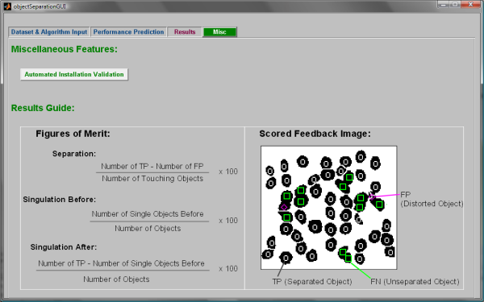
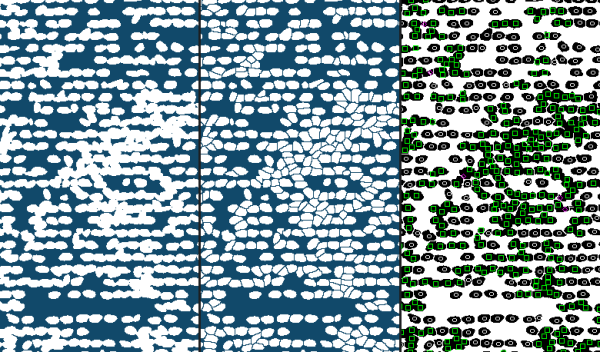
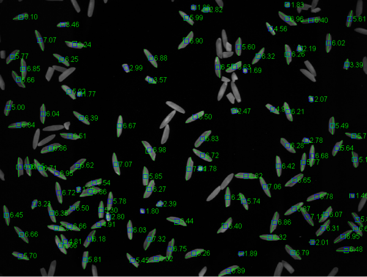

# My Professional Projects

Celebrating over 13 years as a Research Engineer (image processing / machine vision) and Software Engineer (real time 3D graphics); please browse some of the projects that I have worked on professionally.

## 2007-2009 - Image Processing Engineer (research engineer) @ Buhler Sortex

Optical sorting machines designed to operate at high-speed, and thus can sort faster than hand sorting. For a rice sorting machine in 2007, Basmati rice could be effectively sorted at 12 tonnes per hour depending on the required sort quality.

At sortex I worked as an Image Processing Engineer, where we built algorithms, prototypes and always created our own tools (usually in MATLAB).

### Feed Quality Measurement

I built an algorithm and tool in MATLAB that measures the feed of rice down a glass slope, and reports how 'clumpy' the rice feed is; where more clumpy is lower quality feed and causes false positives in the final sort output. The tool was used by myself and a mechanical engineer to test their prototype modifications to the slope mechanism of an optical sorting machine. With this tool we found a new mechanical prototype that works in improving the feed quality by separating the rice grains as they slide down several layers.

The output was reported on screen, as well as some graphs.

### Defect Browser

I built a tool in MATLAB that allows the simulation of algorithm settings to help the user select appropriate sensitivities to maximise accepted product, and minimise wastage during classification.

### Object Separation

Commissioned by Sortex during my final year at University, this project was conducted to research and build a prototype algorithm to separate touching objects such as a feed of rice grains.

In this example a normal algorithm would interpret all touching objects as a single object (left side). If an automatic separation method is used, the touching grains could be somewhat divided, allowing them to be uniquely identified (right side).

I designed a tool to allow multiple data-sets and algorithms to be used and tested.

The algorithm that I built worked as shown below on Risotto rice. Left is the input rice image; then the output of object separation; the right image shows the feedback markings.

## 2009-2013 - Sponsored PhD in Machine Vision @ Kingston University London

The main objective of this thesis was the design, implementation, and accuracy evaluation of an on-line system for the measurement of broken rice grains. Again, the coding language was MATLAB.

Below is an example output images pair after my algorithm had finished processing the measurement of broken rice. The colour given to the rice objects indicate the status of the rice grain – black indicates a gain to be measured by the system. The back projection of the estimated rice length (in millimetres) is represented by the green lines; which was used as one component of the algorithm to determine if a rice grain is broken.

The experimental algorithm was first tested on hardware with a static feed.

The algorithm was expanded to handle objects in motion, removing errors caused by movement and touching grains.

Example measurement results for a large input of rice grains into the measurement device.

I was awarded my doctorate, and became a PhD, in 2013; the thesis is available [online](https://eprints.kingston.ac.uk/id/eprint/43011/).

## 2013-2015 - Software Engineer in 3D real time graphics @ Red Bee Media

The Piero team was a small group of 14, from a company of 5,000; we worked on a 3D real time Augmented Reality tool that generated graphics for sports video footage. Piero was used for broadcast TV across the world. I built new effects as shown in the examples below, as well as maintaining code and improving performance.

The tool was built to auto track the sports arena using the ground markings, which the operator would mark manually if the pitch was not auto-detected. We wrote the software in Java using a Linux system, using OpenGL for the graphics rendering.

'Opta' data was new and exciting, and I created visualisations of the data as shown in this case for football.

In the bove you can see the software that we wrote in the background, which had a user interface for an operator to create the effects they wanted -- in the same way an operator of ‘Adobe After Effects’ would create their animations and render them out --.

Somes rugby visualisations that I worked on:

Other sports such as Basketball could be used by the same tool:

## 2015-2018 - Game Designer/Developer of 'Dark Wish' @ Freelance

I designed my first game using 2.5D movement and maths, including writing the story and characters; drawing the artwork; and programming the game engine. This is available on 'Steam' for PC. I built the engine with Lua, c++, and the Love2D graphics/audio framework (OpenGL and SDL based).

## 2018-2020 - Senior Software Engineer in Augmented Reality Graphics @ Holition

### Augmented Reality Foundation Simulation

I led a research and development project to improve the rendering techniques used for simulating makeup. Foundation is difficult to simulate since it is semi-transparent, with various properties. In particular mixing colours correctly is difficult to simulate realistically. I built a new algorithm that runs in real time on the GPU and can mix an infinite number of colours together using an estimate of the optical properties (made from the colour) and the assumption that the materials are transparent. This work was built with Python prototypes, and c++ for real time implementation (using OpenGL graphics).

One of the main goals was to provide a better algorithm that could simulate 'the wrong foundation', since it is very difficult to match foundation to a user's skin colour, but the simulation should still look correct. The improved algorithms I created worked better with extreme colours being mixed (dark on light skin, for example).

Also, the simulation of the product was more realistic by both user testing and by quantitative analysis, in which I had created a visual comparison measurement tool to determine the accuracy of the rendering technique as compared to the real thing.

### Augmented Reality Tutorials

I took over the lead of a research and development project to build an animation tool that took After Effects animations and portray them onto the face using the in house face-tracking technology. This tool was to be available in web browsers. I created a solution to real-time convert the adobe data into a format that would be applied to a mesh-warping mechanism to put the effects on the face. This was a c++ project, with NodeJS and Emscripten layers to make the project run on the web.

Burbery had released their branded version of the tool as their [Virtual Beauty Studio](https://hypebae.com/2020/10/burberry-beauty-virtual-studio-ar-makeup-looks-essentials-glow-palette-contour-blush-highlight-price-where-to-buy).

## 2020 - Game Designer/Developer of 'Daemon Team Six' @ Freelance

I am working on a new hobby project that will be cross-platform (including Nintendo Switch), PC, Linux, Apple iOS, and web browser. This will be crowd-funded.

More is posted on my website [teamjungle.net](https://www.teamjungle.net/).
